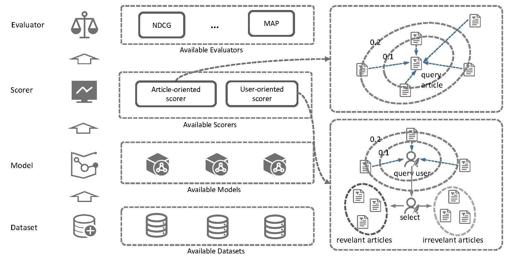

### Introduction

Information overload of the considerable, ever-increasing scientific publications is a critical issue confronted by the whole research community. Searching for the highly similar/relevant articles from vast article datasets (e.g., PubMed) using traditional information retrieval systems is not easy, because the short query (usually several keywords) is not informative to reflect user's information need. In this context, similar article recommendation task can be very useful, it can mitigate the information overload issue by recommending those highly similar/relevant articles to users according to the informative queries, article. In other words, recommending more articles by the query articles that users are of interested is the aim of the similar article recommendation task. This project provides an evaluation framework for this task, and benchmarked nearly 20 approaches covering most exiting
methods and web systems, and a variety of text representation models as well.

### Evaluation framework

The evaluation framework consists of four modules: dataset preparing, training, scoring and evaluating, which form a complete
workflow of evaluation. In the first stage, datasets are required by the framework, they can be either the new ones curated by
experimenters or selected from existing ones. In the training stage, new models can be similarly implemented in the trainer folder, or simply by choosing from the provided list of models. This stage will train multiple models while saving the best
models in the training phase. In the third stage, the saved models are reloaded for inferring on the test datasets. In the last
stage, the performance evaluation is conducted based on the predictions of the previous stage. some commonly used ranking metrics
have been implemented in this framework such as MAG and NDCG. After all these stages finished, the evaluation metrics of different models on different datasets in scenarios can obtain with the framework.

This framework considers two recommendation scenario: article-oriented (AO) and user-oriented (UO) scenarios (depicted in the
framework diagram). The article-oriented scenario ranks the candidates articles according to the similarity between the candidate
and the query article, In user-oriented scenario, the ranking orders of candidates are determined by its similarities to the two
sets of articles (positives and negatives). To facilitate reuse, This framework abstracted several programming interfaces to
enable the scoring process of each method is implemented independently.

### Benchmarked approaches and performance

#### the dataset

The evaluation now conducted on RELISH, a large dataset toward benchmarking biomedical similar articles recommenders, it was
curated via crow-resourcing, with more than 1,500 word-wide biomedical scientists from various research areas participating. This
dataset can meet a high standard of quality, it was assessed by rigorous quality control. To benchmark AO methods, queries of
RELISH are split into the standard training/test/validation folds following the ratio 8:1:1. However, benchmarking UO methods
should be slightly different from benchmarking AO methods, as they learn recommendation from relevant and irrelevant articles
instead of query-candidate pairs. To copy with it, the candidates under each query are split to the training/test/validation parts
to build the evaluation dataset for UO methods.

#### fine-tuning BERT models as article recommenders

In addition to some shallow text representation models. BERT, the state-of-the-art language technique in NLP, is also introduced
to this task. Here two pre-trained models AllenAI's SPECTER, BioBERT consider in the evaluation. To apply BERT for article
recommendation, the triplet loss to optimize BERT models for the AO scenario, where a valid training instance is a triplet: a
query article, and two kinds of candidates, i.e., relevant candidates, and the irrelevant candidates. The tuning process with the
triplet loss in this scenario is to minimize the distance between query article and relevant article, and maximize the distance
between query article and irrelevant article. In UO scenario, the tuning process should learn the preference of users from the
relevant and irrelevant article sets due to the lacking of explicit queries. In this regard, the contrastive loss was used to
minimize the distance among the positives while maximizing that between the negatives.

#### benchmark

The following table is the experimental results of article-oriented (AO) recommenders on the RELISH dataset

|Approach Group|Approach|MAP@5|MAP@10|MAP@15|NDCG@5|NDCG@10|NDCG@15|Avg.|
|:----|:----|:----|:----|:----|:----|:----|:----|:----|
|Random|Random|79.33|77.22|75.41|80.7|77.67|76.4|77.79|
|Lexicon|XPRC|84.34|81.98|80.59|85.32|82.43|81.78|82.74|
| |BM25|88.91|86.72|84.54|89.48|87.39|86.21|87.21|
| |PMRA|90.3|87.57|85.75|90.95|88.4|87.45|88.4|
|Word Embedding|fastText|85.75|82.81|81.79|86.79|83.79|83.12|84.01|
| |GloVe|86.71|83.72|82.27|87.5|84.24|83.83|84.71|
| |BioWordVec|89.84|86.51|84.67|89.9|86.67|85.53|87.19|
|Sentence Embedding|InferSent-v2|82.14|79.93|78.74|83.97|81.45|80.76|81.17|
| |InferSent-v1|85.21|82.16|80.41|86.56|83.31|82.35|83.33|
| |WikiSentVec |87.92|85.23|83.4|88.65|85.74|84.81|85.96|
| |BioSentVec |90.76|88.1|86.16|90.05|87.76|86.89|88.29|
|Document Embedding|LDA|85.44|82.66|80.36|86.51|82.91|81.31|83.2|
| |Doc2vec|88.31|85.83|84.61|89.02|86.23|85.57|86.6|
|BERT|BioBERT|88.14|85.81|83.9|88.97|86.29|85.1|86.37|
| |SPECTER|92.27|90|88.36|91.47|89.12|88.42|89.94|
|BERT with fine-tuning|BioBERT  (tuned)|94.11|92.1|90.64|92.85|90.72|89.93|91.73|
| |SPECTER (tuned)|93.76|91.65|90.39|93.4|91.2|90.52|91.82|

Although BM25 and PMRA show better performance than most of the methods, the AO-benchmark suggests that they are suboptimal to
several text representation methods. The tuned models, SPECTER, BioBERT outperform them by a large margin. For some
domain-specific models (e.g., BioSentVec, and BioWordVec) trained specifically for biomedicine are superior to their generic
equivalents (e.g., InferSent, WikiSentVec, fastText, and GloVe). As shows in this benchmark, there are significant improvements
over the original ones via fine-tuning, suggesting that fine-tuning is helpful for this task. After fine-tuning, we found SPECTER
is the best-performing method among all the AO methods, it not only better than the original SPECTER, but more importantly,
significant outperforms PMRA, the underlying method of "Similar Article" feature in the PubMed interface.

Similarly, experimental results of user-oriented (UO) recommenders on the RELISH dataset is as follows:

|Approach Group|Approach|MAP@5|MAP@10|MAP@15|NDCG@5|NDCG@10|NDCG@15|Avg.|
|:----|:----|:----|:----|:----|:----|:----|:----|:----|
| |Random|78.14|76.32|75.72|80.73|77.65|76.71|77.55|
|Web System|MScanner|87.19|84.92|83.73|87.16|84.48|83.21|85.12|
| |BioReader|88.23|86.02|85.21|87.83|85.13|84.41|86.14|
| |MedlineRanker|88.69|86.33|85.32|88.1|85.6|84.36|86.4|
|Word Embedding|GloVe|88.59|86.51|85.31|88.19|85.61|84.45|86.44|
| |fastText|88.88|86.73|85.23|88.35|85.79|84.13|86.52|
| |BioWordVec|89.24|87.17|86|88.59|86.04|84.58|86.94|
|Sentence Embedding|InferSent-v2|88.71|86.5|85.59|88.25|85.63|84.37|86.51|
| |InferSent-v1|89.17|87.11|86.36|88.57|86.05|84.93|87.03|
| |WikiSentVec |90.09|87.97|86.83|89.16|86.81|85.55|87.74|
| |BioSentVec |91.03|89.15|88.16|89.89|87.63|86.65|88.75|
|Document Embedding|LDA|86.22|83.7|83.43|86.46|83.51|82.86|84.36|
| |Doc2vec|88.29|85.89|84.64|87.99|85.12|83.62|85.93|
|BERT |BioBERT|89.56|87.01|86.17|89.71|87.38|86.7|87.76|
| |SPECTER|90.65|88.49|87.54|90.52|88.66|87.78|88.94|
|BERT with fine-tuning|SPECTER (tuned)|90.91|88.66|88.23|90.66|88.74|88.09|89.22|
| |BioBERT  (tuned)|90.81|88.59|88.04|90.81|88.88|88.2|89.22|

Among the three recommendation systems (MScanner, BioReader, and MedlineRanker), MScanner performed least well than other
competing systems. In addition, the BERT-like models further improved the existing recommendation systems by wide margins on the
UO-benchmark, which suggests that the advanced technology can further boost the systems.
